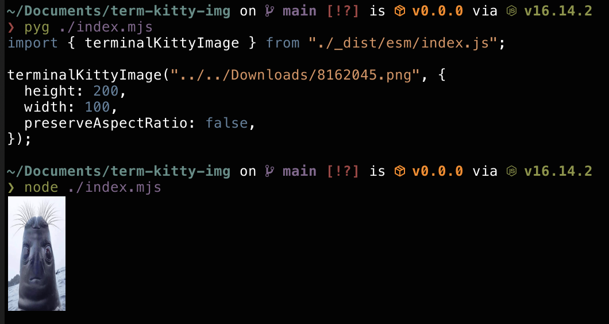

# term-kitty-img

Show images in your kitty terminal.

(Based on [npm:term-img](https://github.com/sindresorhus/term-img) but for kitty protocol instead of iTerm2)



# Install

```sh
npm install term-kitty-img
```

# Usage

```js
import { terminalKittyImage } from "term-kitty-img";

function fallback() {
  // Return something else when not supported
}

terminalKittyImage("unicorn.jpg", {
  width: 800, // default bounding box of 600px wide
  height: 150, // default bounding box of 600px high
  // note: dimensions are in pixels (cannot use percentages or cells)
  preserveAspectRatio: false, // default true
  // note:
  // (when false, width and height are exact, image stretches)
  // (when true, width and height act as a contain box, image shrinks to fit)
  fallback: () => {
    console.error("Could not load unicorn");
  },
});
```

## Notes

The kitty protocol is very awkward to use with Node. I was lucky to find a way to make it
work by using spawn with stdin:inherit, if someone has a better way to solve this lmk!

---

Output code is ES6 and targets:

- node 10+
- All major non-dead browsers (>93%)

---

MIT
